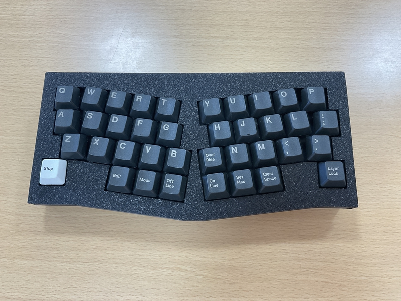
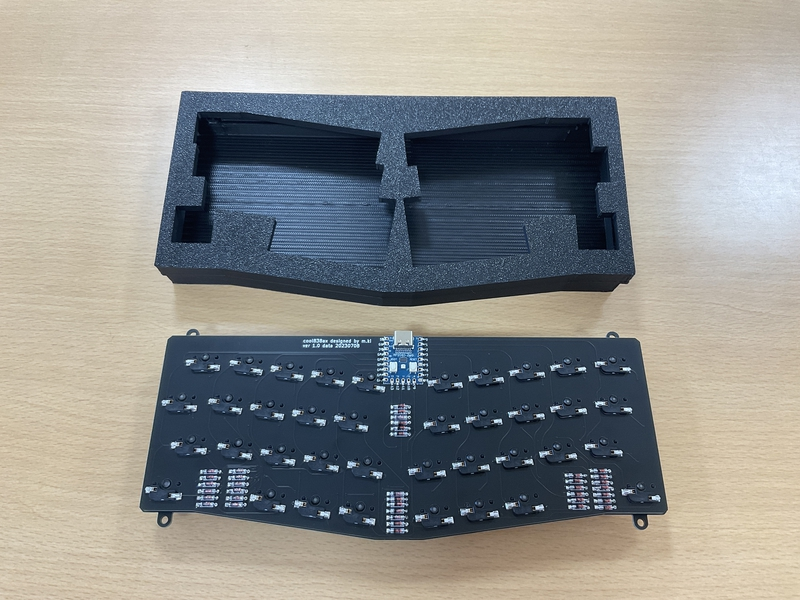
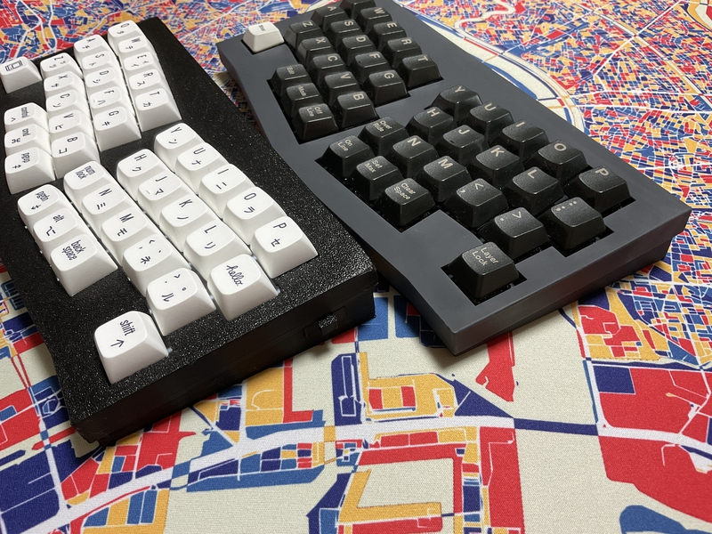

# cool838ax / cool838axble

cool838ax / cool838axble is a small keyboard.
 
This keyboard has 38 keys.
 
cool838ax / cool838axble is an Alice layout.
 
cool838ax use RP2040-Zero,run QMK_firmware.
 
cool838axble use Ble Micro Pro,run QMK_Firmware,and Bluetooth。

## Firmware

[Here](https://github.com/telzo2000/cool838ax/tree/main/firmware)

## Buildguide

For cool838ax
 
https://github.com/telzo2000/cool838ax/blob/main/buildguide_for_cool838ax.md
 
For cool838axble
 
https://github.com/telzo2000/cool838ax/blob/main/buildguide_for_cool838axble.md
### Builde log

[Tweet](https://twitter.com/0002ozlet/status/1682569430923087872?s=20)

## Parts list

### For cool838ax

| No. | Patrs | Quantity | remarks | Suppliers | Cost |
|--|--|--|--|--|--|
|番号|名前|数|備考|調達先|参考価格（送料込）| 
|1|PCB|1|38key AlicLayout|[elecrow](https://www.elecrow.com) [JLCPCB](https://jlcpcb.com) [ALLPCB](https://www.allpcb.com)|５枚で20〜30ドル| 
|2|Switch Plate|1||[elecrow](https://www.elecrow.com) [JLCPCB](https://jlcpcb.com) [ALLPCB](https://www.allpcb.com)|５枚で20〜30ドル| 
|3|RP-2040Zero|1||[Talp Keyboard](https://talpkeyboard.net)|800円|
|4|Swith socket スイッチソケット|38|cherry MX互換|[遊舎工房](https://yushakobo.jp) [Talp Keyboard](https://talpkeyboard.net) [Daily Craft Keyboard](https://shop.dailycraft.jp)等|10個で165円程度|
|5|Diode ダイオード|38|リードタイプでもSMDでも可|[遊舎工房](https://yushakobo.jp) [Talp Keyboard](https://talpkeyboard.net) [Daily Craft Keyboard](https://shop.dailycraft.jp)等|100個で220円程度から|
|6|TopCase|1|3D Print|||
|7|BottomCase|1|3D Print||

### For cool838axble

| No. | Patrs | Quantity | remarks | Suppliers | Cost |
|--|--|--|--|--|--|
|番号|名前|数|備考|調達先|参考価格（送料込）| 
|1|PCB|1|38key AlicLayout|[elecrow](https://www.elecrow.com) [JLCPCB](https://jlcpcb.com) [ALLPCB](https://www.allpcb.com)|５枚で20〜30ドル| 
|2|Switch Plate|1||[elecrow](https://www.elecrow.com) [JLCPCB](https://jlcpcb.com) [ALLPCB](https://www.allpcb.com)|５枚で20〜30ドル| 
|3|Ble Micro Pro|1|12or13ピンコンスルーも必要|[遊舎工房](https://shop.yushakobo.jp/products/ble-micro-pro?_pos=1&_sid=192f46387&_ss=r)|4950円|
|4|Swith socket スイッチソケット|38|cherry MX互換|[遊舎工房](https://yushakobo.jp) [Talp Keyboard](https://talpkeyboard.net) [Daily Craft Keyboard](https://shop.dailycraft.jp)等|10個で165円程度|
|5|Diode ダイオード|38|リードタイプでもSMDでも可|[遊舎工房](https://yushakobo.jp) [Talp Keyboard](https://talpkeyboard.net) [Daily Craft Keyboard](https://shop.dailycraft.jp)等|100個で220円程度から|
|6|TopCase|1|3D Print|||
|7|BottomCase|1|3D Print||
|8|Switch Parts|1|3D Print||
|9|コンデンサー|1||[秋月電子](https://akizukidenshi.com/catalog/g/gP-02151/)|10個200円|
|10|スライドスイッチ|1||[遊舎工房](https://shop.yushakobo.jp/products/5624?variant=45044666007783)|110円|
|11|リセット用タクトスイッチ|1|なくても大丈夫|[Talp Keyboards](https://talpkeyboard.net/items/5fa258a5f0b10814d183347f) [遊舎工房](https://shop.yushakobo.jp/products/a0800ts-01-1?pr_prod_strat=copurchase&pr_rec_id=ff9ba5a77&pr_rec_pid=6055716618401&pr_ref_pid=8228998578407&pr_seq=uniform)|1個11〜22円|
|12|電池ボックス|1|CR1632電池１個も必要|[モノタロウ](https://www.monotaro.com/p/8835/2765/)|１個239円|

In addition, you will need a USB cable, keycaps, etc.
 
この他に、USBケーブル、キーキャップ等が必要です。
 
