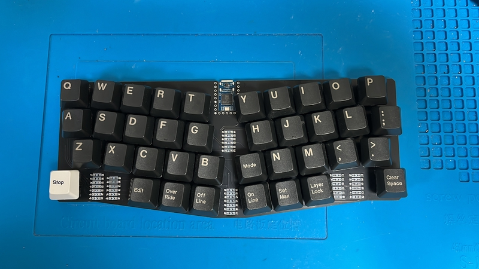

# cool838ax

cool838ax is a small keyboard.
 
This keyboard has 38 keys.
 
cool838ax is an Alice layout.
 
cool838ax use RP2040-Zero,run QMK_firmware.
 

## Firmware

[Here](https://github.com/telzo2000/cool838ax/tree/main/firmware)

## Buildguide

soon later.
## Parts list

| No. | Patrs | Quantity | remarks | Suppliers | Cost |
|--|--|--|--|--|--|
|番号|名前|数|備考|調達先|参考価格（送料込）| 
|1|PCB|1|38key AlicLayout|[elecrow](https://www.elecrow.com) [JLCPCB](https://jlcpcb.com) [ALLPCB](https://www.allpcb.com)|５枚で20〜30ドル| 
|2|Switch Plate|1||[elecrow](https://www.elecrow.com) [JLCPCB](https://jlcpcb.com) [ALLPCB](https://www.allpcb.com)|５枚で20〜30ドル| 
|3|RP-2040Zero|1||[Talp Keyboard](https://talpkeyboard.net)|800円|
|4|Swith socket スイッチソケット|38|cherry MX互換|[遊舎工房](https://yushakobo.jp) [Talp Keyboard](https://talpkeyboard.net) [Daily Craft Keyboard](https://shop.dailycraft.jp)等|10個で165円程度|
|5|Diode ダイオード|38|リードタイプでもSMDでも可|[遊舎工房](https://yushakobo.jp) [Talp Keyboard](https://talpkeyboard.net) [Daily Craft Keyboard](https://shop.dailycraft.jp)等|100個で220円程度から|
|6|TopCase|1|3D Print|||
|7|BottomCase|1|3D Print||

In addition, you will need a USB cable, keycaps, etc.
 
この他に、USBケーブル、キーキャップ等が必要です。
 