## Build guide

## Firmware

###  QMK_FIRMWARE

[Here](https://github.com/telzo2000/cool838ax/tree/main/firmware)

 

[remap](https://remap-keys.app/catalog/pLXvG6i1dYtpbWD7ujzv)

 

## Build 1

### 1 Diode soldering

Solder the diodes to the back of PCB.
 
PCBの裏面にダイオードのハンダ付けをします。
 
There are lead type and SMD diodes.
 
ダイオードはリードタイプか、SMDがあります。
 
Here, we will explain the lead type soldering.
 
ここでは、リードタイプのハンダ付けの説明をします。
 

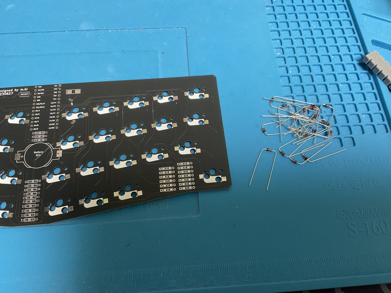

Use a lead bender to bend the legs of the diode.
 
リードベンダーを使い、ダイオードの足を曲げます。
 
Insert the diode into the board.
 
ダイオードを基板に挿しこみます。
 

Please pay attention to the orientation of the diode.
 
ダイオードの向きに注意してください。
 

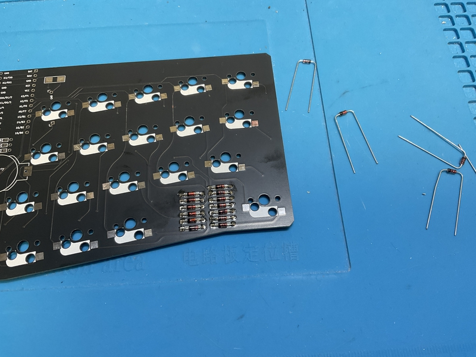

Secure the diode with masking tape, then face up.
 
マスキングテープでダイオードを固定してから、表面を上にします。
 
Solder the protruding legs.
 
はみ出ている足部分に、ハンダ付けをします。
 
After soldering, use nippers to cut off the protruding legs.
 
はんだ付けが終わったら、はみ出ている足をニッパーで切り取ってください。
 

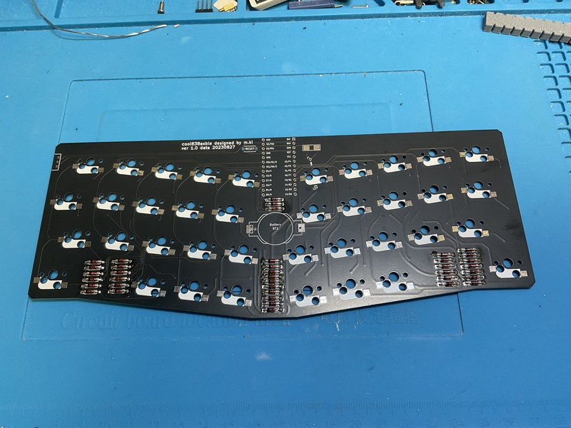

[８倍速　Diodeハンダ付け動画](https://youtu.be/Yaodh2-XxV4)

 
 

### 2 Soldering switch sockets

Solder the switch sockets on the back side.
 
裏面にスイッチソケットのハンダ付けをします。
 

[８倍速　Switch socketハンダ付け動画](https://youtu.be/E__mHvmIXQo)

  

### 3 Soldering the capacitor

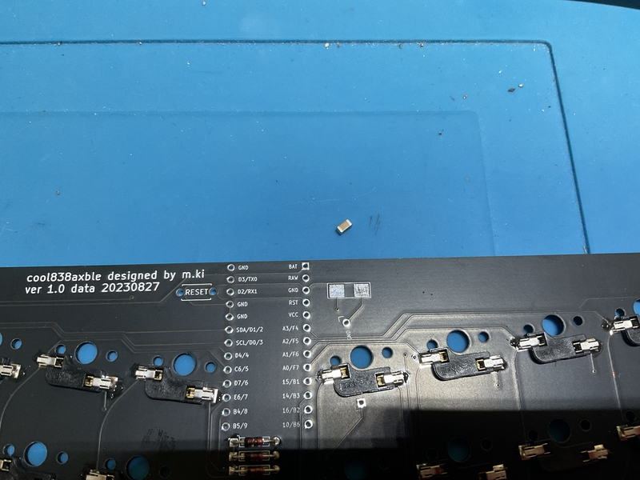

Solder the [capacitor](https://akizukidenshi.com/catalog/g/gP-02151/).
 
[コンデンサー](https://akizukidenshi.com/catalog/g/gP-02151/)をハンダ付けします。
 

First, apply solder to the terminal on one side. Then, place the capacitor, melt the solder, and fix it.
 
最初に、片側の端子にハンダを盛ります。そして、コンデサーを置き、ハンダを溶かして、固定します。
 

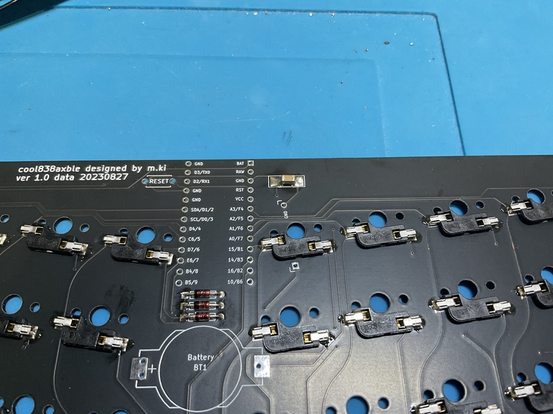

Next, melt and pour solder into the other terminal and attach the capacitor. Please fix it.
 
次に、もう片側の端子にハンダを溶かして、流し込んで、コンデンサーを。固定してください。
 
 

### 4 Soldering the slide switch

Insert the [slide switch](https://shop.yushakobo.jp/products/5624?variant=45044666007783) from the back side of the PCB and solder the front side. Please remove the protruding legs.
 
[スライドスイッチ](https://shop.yushakobo.jp/products/5624?variant=45044666007783)はPCBの裏面から挿入して、表面をハンダ付けします。はみ出た足は、切り取ってください。
 

### 5 Soldering the battery case

[Battery box](https://www.monotaro.com/p/8835/2765/) is inserted from the back of the PCB and soldered on the front side. The protruding legs. Please cut it out.
 
[電池ボックス](https://www.monotaro.com/p/8835/2765/)は、PCB裏面から挿入して、表面をハンダ付けします。はみ出た足は。切り取ってください。

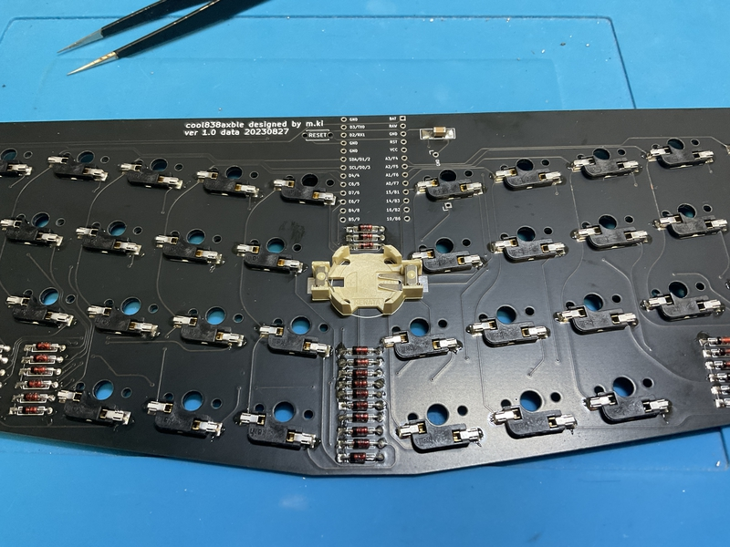

### 6 (Option) Solering the reset switch

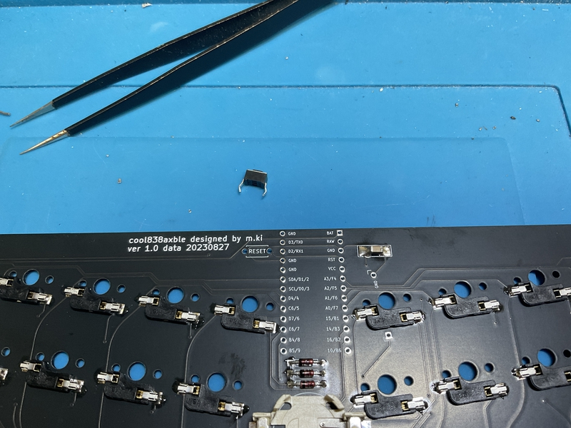

Actually, it's not necessary. If you are an ncool838axble and are trying to install a WPRO microw without buying a Ble Micro Pro, you will need a reset switch.
 

実は必要ありません。もし、あなたがncool838axbleなのに、Ble Micro Proをおごることをせずに、ただのpro micro取り付けようとするならば、リセットスイッチは必要でしょうね。
 

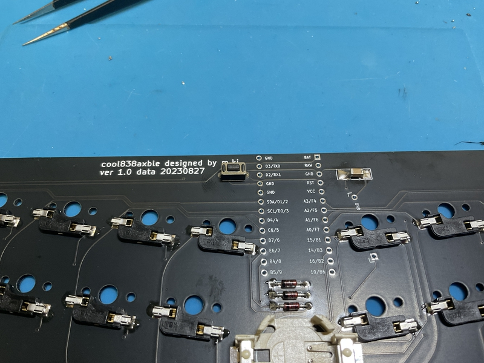

### 7 Ble Micro Pro

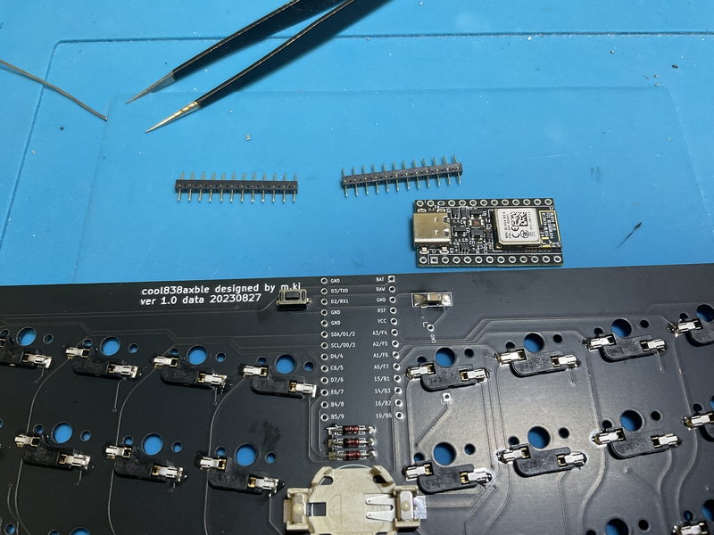

Please prepare [Ble Micor Pro](https://shop.yushakobo.jp/products/ble-micro-pro?_pos=1&_sid=192f46387&_ss=r).
 
[Ble Micor Pro](https://shop.yushakobo.jp/products/ble-micro-pro?_pos=1&_sid=192f46387&_ss=r)を用意してください。
 

If it is a 12-pin con-through, install it as shown in the image. Then insert the Ble Micro Pro.

12ピンコンスルーであれば、画像のように、取り付けてください。そして、Ble Micro Proを挿入してください。
 

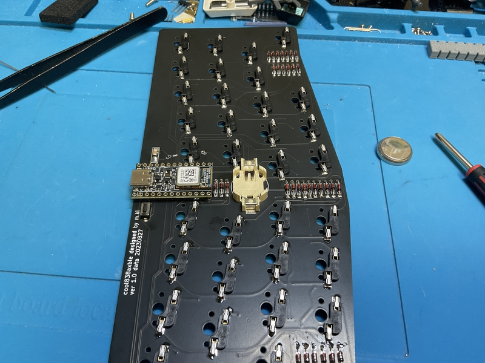

### 8 Please insert the batteries.

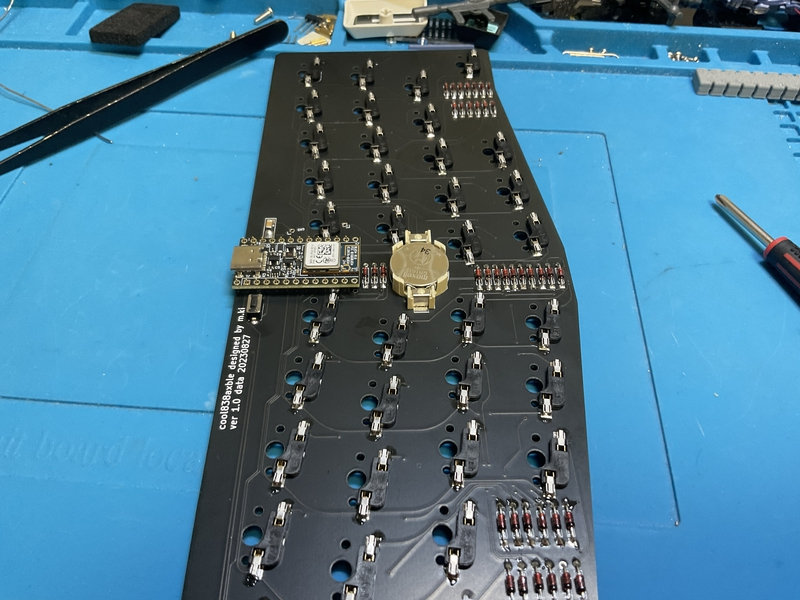

Insert the CR1632 battery into the battery box.
 
CR1632電池を電池ボックスに挿入してください。
 
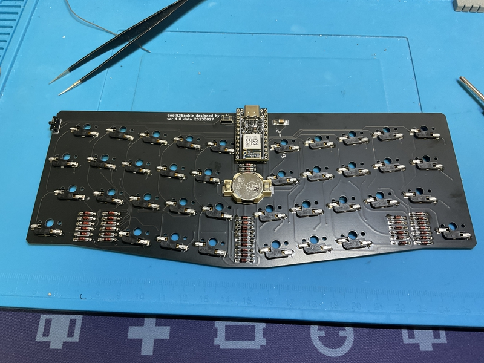

### 9 Firmware

"6 Installing QMK_Firmware on Ble Micro pro" from [this site](https://github.com/telzo2000/cool836qalble/blob/main/build_guide_cool836qalble.md). please refer.
 
[このサイト](https://github.com/telzo2000/cool836qalble/blob/main/build_guide_cool836qalble.md)の「6 Instorlling QMK＿Firmware on Ble Micro pro」を。参考にしてください。
 

### Build 2(case)

### 1 Case

I will explain using a case printed by stereolithography of black resin ordered from JLCPCB. The procedure is basically the same for cases printed with Ankemake M5 for home use.
 
JLCPCBに発注したブラックレジンの光造形で印刷されたケースを使って説明します。家庭用AnkemakeM5で印刷したケースでも作業の手順は、基本的に同じです。
 
 
Fix the magnets to the five dents inside the case with an adhesive or the like. There are ５ in the top case and ５ in the bottom case for a total of １０.Please pay attention to the polarity of the magnet. Make sure the top case and bottom case are magnetically attached.
 
ケースの内側にある５つの凹みに磁石を接着剤などで固定します。トップケースに５箇所、ボトムケースに５箇所の合計１０箇所です。
極性に注意してください。トップケースとボトムケースが磁力で着くようにしてください。
 

As shown in the image below, attach rubber O-rings to the four protrusions on the bottom case. This makes it a gasket mount. You can do without the O-ring, but the PCB may move up and down inside the case.
 
下の画像のように、ボトムケースに4箇所の凸部にゴムのO-ringを装着します。これによりガスケットマウントとなります。O-ringはなくても大丈夫ですが、ケース内で、PCBが上下に動く可能性があります。
 

The O-ring in the image is [this product](https://www.amazon.co.jp/gp/product/B07G4SM5SM/ref=ppx_yo_dt_b_asin_title_o03_s00?ie=UTF8&psc=1).
 
画像のO-ringは[この商品](https://www.amazon.co.jp/gp/product/B07G4SM5SM/ref=ppx_yo_dt_b_asin_title_o03_s00?ie=UTF8&psc=1)です。
 
Pay attention to the orientation of the Switch Parts and attach them to the bottom case.
 
Switch Partsの向きに注意して、ボトムケースに取り付けてください。
 

 
Place the hole in the switch plate on the O-ring. And it is completed by covering the top case.
 
スイッチプレートの穴をO-ringに載せます。このとき、水平スライドスイッチのつまみがSwitch Pasrtsの窪みに入るようにしてください。そして、トップケースを被せて完成です。
 

Welcome to the world of 38 keys.
 
38キーの世界へようこそ。
 